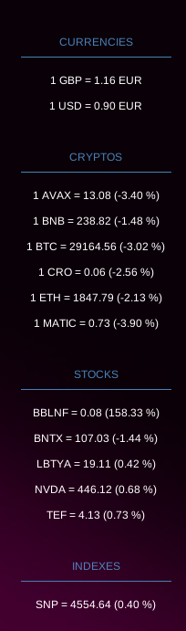

# Ticker fetcher

This is a simple CLI tool to track stocks, indexes,
funds, etc. The information it outputs needs to be used with
[conky](https://github.com/brndnmtthws/conky). However the software should
be easy to modify for any sort of output.

**Example with conky:**




```shel
ticker_fetcher --help
Fetch financial information like stock tickers, funds, cryptos, etc.

Usage:
  ticker_fetcher [command]

Available Commands:
  completion  Generate the autocompletion script for the specified shell
  crypto      Fetch exchange rates for cryptos.
  fiat        Fetch exchange rates.
  fund        Fetch performances for ETFs
  help        Help about any command
  index       Fetch indexes performances
  stock       Fetch performances for stocks

Flags:
  -h, --help   help for ticker_fetcher

Use "ticker_fetcher [command] --help" for more information about a command.
```

Example:

```shell
ticker_fetcher stock AAPL
${alignc}AAPL = 192.75 (0.42 %)
```
